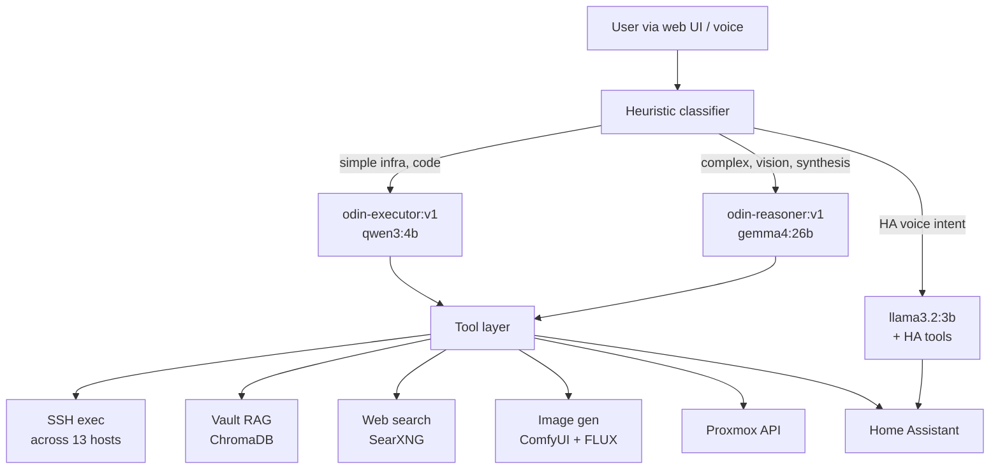

# Odin

A self-hosted, voice-enabled AI agent running locally on Ollama. Built for homelab operators who want a single assistant that can SSH across their infrastructure, reason about it, control Home Assistant, generate images, search the web, and remember everything via an Obsidian vault — all without sending any data to third-party APIs.

> **Heads up:** This is a personal homelab project built for my own infrastructure (BeanLab). Hostnames, IPs, and paths throughout the codebase are specific to that environment and will need editing for yours. It's published as a reference, not a turnkey product.

## What Odin does

- **Multi-model routing.** Three role-specific Ollama variants work together: a fast classifier, a tool-chain executor, and a heavier reasoner for synthesis and vision.
- **SSH orchestration across the homelab.** Single-prompt commands fan out to every host in `hosts.json` with destructive-command guardrails.
- **Home Assistant control.** Natural language → HA service calls via the REST API.
- **Proxmox VE management.** Direct REST API access to cluster nodes, VMs, and LXC containers.
- **Vault-backed memory.** Semantic search over an Obsidian vault via ChromaDB + `nomic-embed-text` embeddings.
- **Web search.** Self-hosted SearXNG aggregator, no third-party API keys.
- **Local image generation.** ComfyUI with FLUX.1-schnell, VRAM-aware model swapping.
- **Voice interface.** Wyoming Protocol stack: Whisper (STT), Piper (TTS), OpenWakeWord.
- **Web UI.** Flask-based chat with model picker, file uploads, voice modal, multi-chat persistence.

## Architecture



Requests are classified by a deterministic heuristic function (not an LLM call) that maps each user message to one of three roles. The executor and reasoner are Ollama Modelfile variants with role-specific system prompts baked in. The voice role stays on base Llama 3.2 3B because Meta specifically trained it for on-device tool calling.

## Model lineup

| Role | Tag | Base | VRAM | Purpose |
|---|---|---|---|---|
| Router | `odin-router:v1` | llama3.2:3b | ~2.5 GB | Strict JSON classifier (optional; heuristic routing is default) |
| Executor | `odin-executor:v1` | qwen3:4b | ~3.5 GB | Tool chains, SSH, code, simple infra queries |
| Reasoner | `odin-reasoner:v1` | gemma4:26b | ~16 GB | Complex reasoning, multi-host synthesis, vision, written deliverables |
| Voice | `llama3.2:3b` | (base) | ~2.5 GB | Home Assistant voice intent |

Total VRAM budget: ~22.5 GB on a 24 GB RTX 3090. Image generation (FLUX.1-schnell, ~12 GB) triggers automatic unload of the reasoner.

## Requirements

- Linux host with NVIDIA GPU (tested on RTX 3090, 24 GB)
- Docker + Docker Compose
- [Ollama](https://ollama.com) with GPU support
- Python 3.11+
- Optional: Proxmox VE cluster, Home Assistant, Obsidian vault

## Installation

> These instructions get you a working Odin. They assume you'll edit `hosts.json` and various config paths to match your own environment.

### 1. Clone and set up Python environment

```bash
git clone https://github.com/YOUR-USERNAME/Odin.git
cd Odin
python -m venv venv
source venv/bin/activate
pip install -r requirements.txt
```

### 2. Configure environment

```bash
cp .env.example .env
# Edit .env with your tokens, URLs, and paths
```

### 3. Pull base models and build Odin variants

```bash
ollama pull llama3.2:3b
ollama pull qwen3:4b
ollama pull gemma4:26b
ollama pull nomic-embed-text

# Build the role-specific model variants
cd Odins_Self/prompts/v1
./build-odin-models.sh
```

### 4. Deploy supporting services

See [`docs/deployment.md`](docs/deployment.md) for SearXNG, ChromaDB, ComfyUI, and Home Assistant integration. The `setup-tier1.sh` script automates most of this.

### 5. Configure your host inventory

Edit `hosts.json` to list the machines Odin should manage:

```json
{
  "YourHost": {
    "host": "192.168.1.100",
    "user": "your-ssh-user",
    "description": "What this host does"
  }
}
```

Push SSH keys with `./push_ssh_keys.sh` (reads from `hosts.json`).

### 6. Run Odin

```bash
python Odin.py
```

Web UI: `http://localhost:5050` (or your Tailscale hostname if TLS certs are configured).

## Project layout

```
Odin/
├── Odin.py                    # Main Flask app + Ollama client + tool dispatch
├── hosts.json                 # SSH host inventory (example provided)
├── requirements.txt
├── tools/                     # Tool classes (base, web_search, proxmox_api, ...)
├── Odins_Self/
│   └── prompts/v1/            # System prompts + Modelfiles for odin-*:v1 variants
├── scripts/                   # Utility scripts (embed_vault, build-odin-models, ...)
├── docs/                      # Deployment guides
├── .env.example               # Template for required environment variables
└── README.md
```

## Customizing for your environment

The parts you'll almost certainly need to edit:

- **`hosts.json`** — your actual host inventory
- **`.env`** — all service URLs and tokens
- **`Odin.py`**: `VAULT_PATH`, any hardcoded IPs in classification logic, model tag references
- **`Odins_Self/prompts/v1/odin-executor.system.md`** — the persona mentions "Chad" and "BeanLab"; edit to match your identity
- **`Odins_Self/prompts/v1/odin-reasoner.system.md`** — same persona references

## Acknowledgments

- [dontriskit/awesome-ai-system-prompts](https://github.com/dontriskit/awesome-ai-system-prompts) — reference for agent prompt patterns (Manus agent loop, Claude Code persona framing, same.new tool etiquette)
- [Ollama](https://ollama.com) — the model runtime that makes this practical on a single GPU
- [SearXNG](https://github.com/searxng/searxng), [ChromaDB](https://github.com/chroma-core/chroma), [ComfyUI](https://github.com/comfyanonymous/ComfyUI) — the self-hosted backbone

## License

MIT — see [LICENSE](LICENSE).

## A final warning

This codebase has never been audited for security. It gives an LLM SSH access to your infrastructure. The destructive-command guardrail catches many bad outcomes, but not all of them. Run this inside a trust boundary you're comfortable with, don't expose the web UI to the public internet without authentication, and read the code before you run it.
